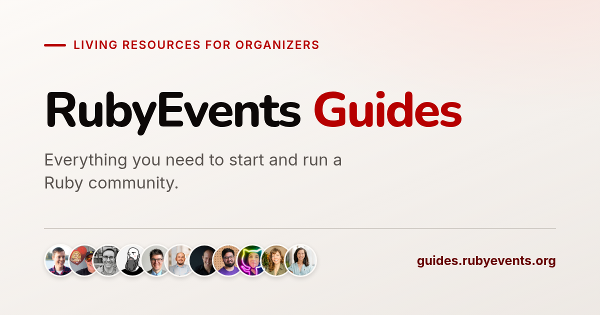

# RubyEvents Guides



Practical, living guides for starting and running Ruby communities — from the first meetup announcement to sustainable conferences.

This repository powers [guides.rubyevents.org](https://guides.rubyevents.org), a companion project to [RubyEvents.org](https://www.rubyevents.org). Our goal is to lower the activation energy for people who want to organize Ruby events by sharing what experienced organizers have learned.

## What is here

- [Meetup guide](https://guides.rubyevents.org/meetups/) — starting, running, and sustaining a local Ruby meetup.
- [Conference guide](https://guides.rubyevents.org/conferences/) — practical guidance for organizing Ruby conferences.
- [Organizer interviews](https://guides.rubyevents.org/interviews/) — our conversations with community organizers.

## Contributing

This project is open source, and contributions are welcome. Useful contributions include fixing content and code contributions.

If you are interested in contributing a conversation, reach out to [Hans Schnedlitz](https://www.rubyevents.org/profiles/hschne) to schedule a conversation.

See [CONTRIBUTING.md](CONTRIBUTING.md) for details, or file an [issue](https://github.com/rubyevents/guides/issues).

## Setup

```bash
bundle install
bundle exec jekyll serve
```

The site will be available at `http://localhost:4000`.

For formatting Liquid and Markdown-adjacent files, install the Node dependencies if needed:

```bash
pnpm install
```

## License

Released under the [MIT License](LICENSE).
